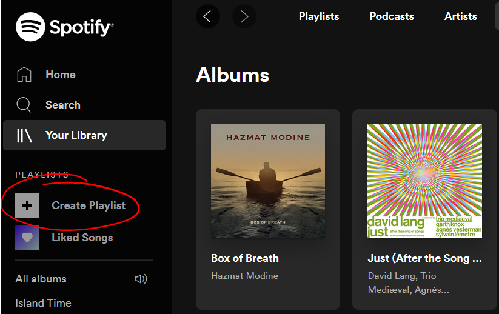
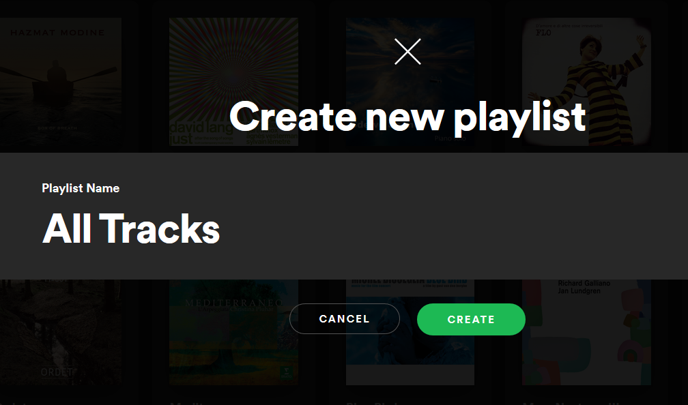
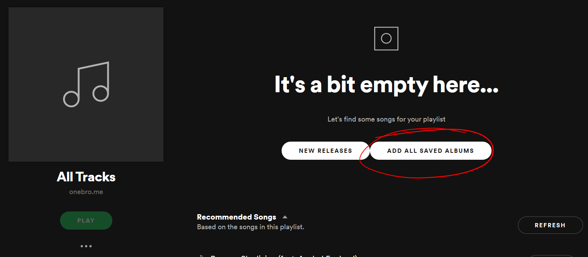
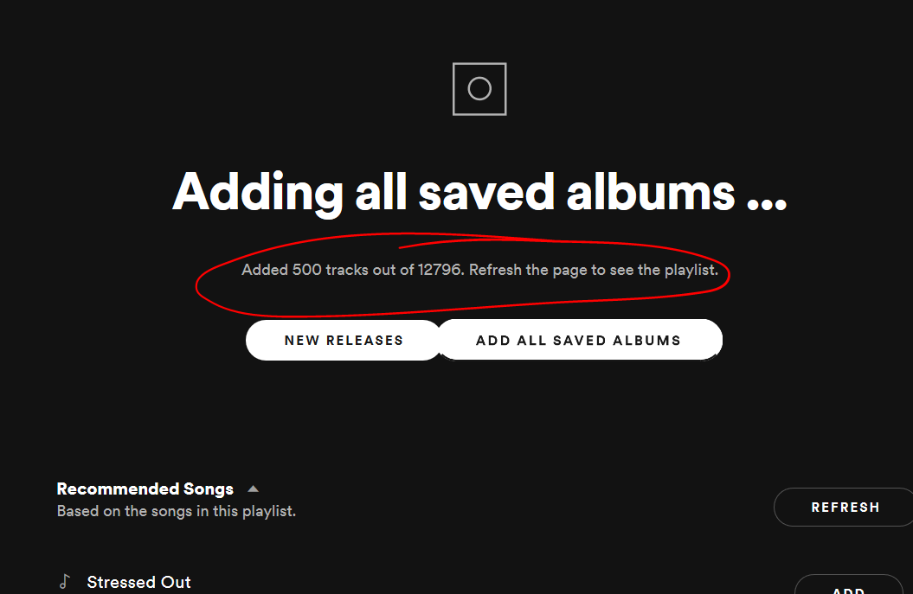
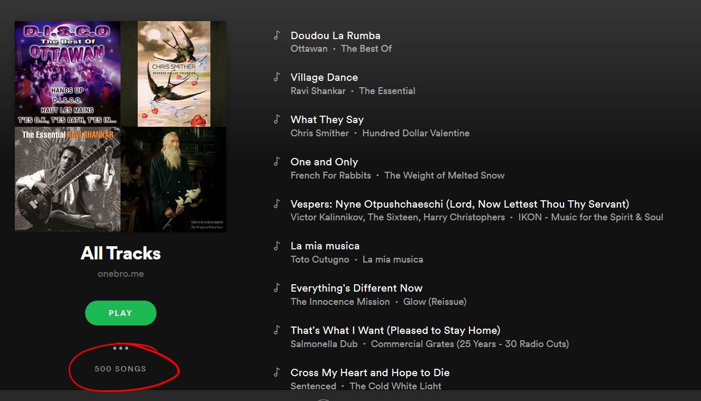
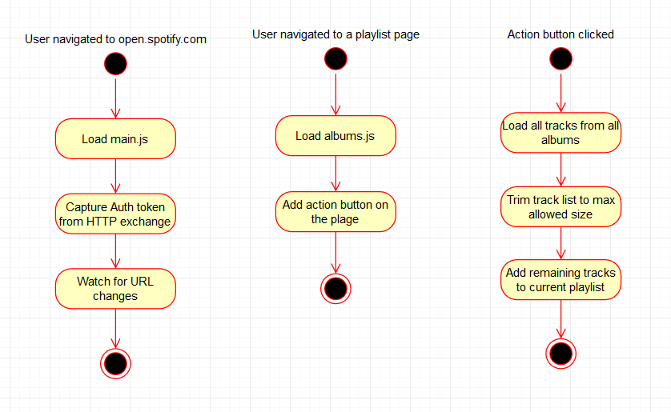

# Spotify All Saved Albums Playlist Builder
#### Compile all tracks from all saved and liked albums into a single playlist

Spotify has a rather confusing system of liked songs, liked albums and a single *Liked Songs* playlist.

1. You have to *Like* a song or all songs in the album to include them in *Liked Songs* playlist.
2. You can only *Like* up to 10,000 tracks. Tough luck if your collection grows bigger than that.

This extension compiles a single playlist from all tracks from all *saved* and *liked* albums in your collection. If the number of tracks is over the allowed playlist limit of 10,000 the extra tracks are randomly culled to get a representative sample. Play it on *shuffle*.

## Usage

#### 1. Install the extension

Install a compiled package from [Releases](https://github.com/rimutaka/spotify-play-all-saved-albums/releases/tag/v.0.1) or download and compile the [source](https://github.com/rimutaka/spotify-play-all-saved-albums).

#### 2. Create a new playlist

#### 3. Enter a name for the playlist

#### 4. You should see an extra button. 
*Add All Saved Albums* button is only available in empty playlists.

#### 5. Click on `ADD ALL SAVED ALBUMS` button and let it go through your collection.
You should see a success message on completion.

#### 6. Refresh the page to see the tracks.

#### If something goes wrong

The button may not appear or the processing may not start or it may fail halfway through. Refresh the page and try again. 

You may need to delete the playlist and start anew if some tracks already got added to it.

Report your problems in [Issues](https://github.com/rimutaka/spotify-play-all-saved-albums/issues).

#### Maximum playlist size

Spotify claims there is a limit of 10,000 tracks per playlist, but I managed to go higher than that. The limit is set as `const maxPlaylistSize = 10000` inside `main.js` to stay on the safe side.

Extra tracks are removed randomly if your collection is larger than the set limit. Generating multiple playlists from the same collection will produce different culling results on every run. See `trimPlaylist` function for more detail.

Tracks are not shuffled and appear in the order albums appear in your *Albums collection*.

#### Updating your playlist

There is no way to add new tracks to it other than by hand. It may be easier to delete and re-create the entire playlist.

# Anatomy of the extension

